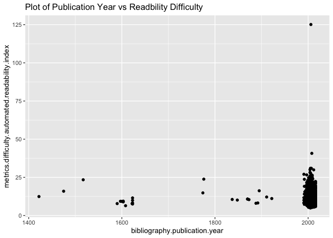

# Load packages

```r
library (here)
```

```
## here() starts at /Users/deni/Downloads/group_07
```

```r
library (ggplot2)
library (dplyr)
```

```
## 
## Attaching package: 'dplyr'
```

```
## The following objects are masked from 'package:stats':
## 
##     filter, lag
```

```
## The following objects are masked from 'package:base':
## 
##     intersect, setdiff, setequal, union
```

# Introduction 

Project Gutenberg is a free online source which provides free access to more than 60,000
books- mostly classics. Its purpose is to crete digital copies of books in the public domain and
thus make them more accessible and foster a love of reading to new generations of readers.
The Gutenberg project stores troves of information about each available book- including both metadata
about the author and work itself as well as popularity, difficulty and readibility metrics for each book.

# Data Set

The data set which will be used in this project can be downloaded [here](https://corgis-edu.github.io/corgis/csv/classics/?fbclid=IwAR0u9jexVHzWWvP65r7sKXYw8VvKiih80BQIzPVu8HjcpsXwjxVN9n5jCeE).
The rows represent books vailable through Project Gutenberg and the columns are attributes
of these books- e.g. meta data and popularity metrics.

# Exploratory Data Analysis

## Loading File


```r
books_data<- read.csv ("classics.csv")
```


## How many observations do we have?


```r
dim(books_data)
```

```
## [1] 1006   38
```
 This shows that in the data there are 38 variables avilable for 1006 books. 
 
## What are the names of the columns (i.e. the vriables we can use in our analysis)?


```r
colnames(books_data)
```

```
##  [1] "bibliography.congress.classifications"          
##  [2] "bibliography.languages"                         
##  [3] "bibliography.subjects"                          
##  [4] "bibliography.title"                             
##  [5] "bibliography.type"                              
##  [6] "metadata.downloads"                             
##  [7] "metadata.id"                                    
##  [8] "metadata.rank"                                  
##  [9] "metadata.url"                                   
## [10] "bibliography.author.birth"                      
## [11] "bibliography.author.death"                      
## [12] "bibliography.author.name"                       
## [13] "bibliography.publication.day"                   
## [14] "bibliography.publication.full"                  
## [15] "bibliography.publication.month"                 
## [16] "bibliography.publication.month.name"            
## [17] "bibliography.publication.year"                  
## [18] "metadata.formats.total"                         
## [19] "metadata.formats.types"                         
## [20] "metrics.difficulty.automated.readability.index" 
## [21] "metrics.difficulty.coleman.liau.index"          
## [22] "metrics.difficulty.dale.chall.readability.score"
## [23] "metrics.difficulty.difficult.words"             
## [24] "metrics.difficulty.flesch.kincaid.grade"        
## [25] "metrics.difficulty.flesch.reading.ease"         
## [26] "metrics.difficulty.gunning.fog"                 
## [27] "metrics.difficulty.linsear.write.formula"       
## [28] "metrics.difficulty.smog.index"                  
## [29] "metrics.sentiments.polarity"                    
## [30] "metrics.sentiments.subjectivity"                
## [31] "metrics.statistics.average.letter.per.word"     
## [32] "metrics.statistics.average.sentence.length"     
## [33] "metrics.statistics.average.sentence.per.word"   
## [34] "metrics.statistics.characters"                  
## [35] "metrics.statistics.polysyllables"               
## [36] "metrics.statistics.sentences"                   
## [37] "metrics.statistics.syllables"                   
## [38] "metrics.statistics.words"
```

## What is the relationship between year of publication and reading difficulty as measured by the automatic readibility index?

```r
books_data %>%
  ggplot() +aes (bibliography.publication.year, metrics.difficulty.automated.readability.index) +geom_point() +ggtitle("Plot of Publication Year vs Readbility Difficulty")
```

<!-- -->

## What is the relationship between country of publication and average sentence length? Has the average gotten longer or shorter over time?

```r
books_data %>%
  ggplot() +aes (bibliography.publication.year, metrics.statistics.average.sentence.length) +geom_point() +ggtitle("Plot of Publication Year vs Sentence Length")
```

<!-- -->


## Sentiment Analysis

# Research Question

1. How do the prevalent sentiments  in books in Project Gutenberg change based on publication year?
