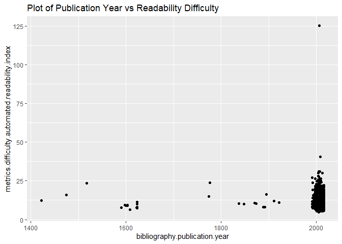
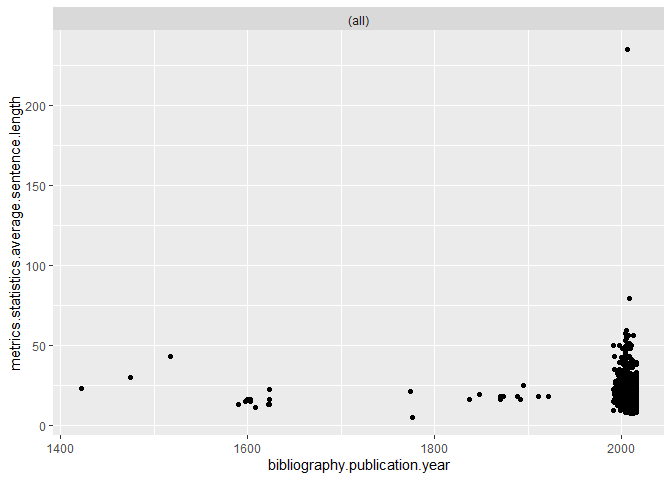
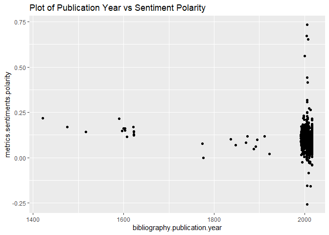

# Introduction 

Project Gutenberg is a free online source which provides free access to more than 60,000
books- mostly classics. Its purpose is to crete digital copies of books in the public domain and
thus make them more accessible and foster a love of reading to new generations of readers.
The Gutenberg project stores troves of information about each available book- including both metadata
about the author and work itself as well as popularity, difficulty and readibility metrics for each book.

# Data Set

The data set which will be used in this project is the classics.csv file which can be downloaded [here](https://corgis-edu.github.io/corgis/csv/classics/?fbclid=IwAR0u9jexVHzWWvP65r7sKXYw8VvKiih80BQIzPVu8HjcpsXwjxVN9n5jCeE).
The rows represent individual books available through Project Gutenberg and the columns are attributes
of these books. The complete set of attributes collected for each book are defined as:

<table class="table table-condensed" style="width: auto !important; margin-left: auto; margin-right: auto;">
 <thead>
  <tr>
   <th style="text-align:left;position: sticky; top:0; background-color: #FFFFFF;"> Variable </th>
   <th style="text-align:left;position: sticky; top:0; background-color: #FFFFFF;"> Data Type </th>
   <th style="text-align:left;position: sticky; top:0; background-color: #FFFFFF;"> Description </th>
   <th style="text-align:left;position: sticky; top:0; background-color: #FFFFFF;"> Example </th>
  </tr>
 </thead>
<tbody>
  <tr>
   <td style="text-align:left;"> bibliography.congress classifications </td>
   <td style="text-align:left;"> String </td>
   <td style="text-align:left;">  </td>
   <td style="text-align:left;"> "PR" </td>
  </tr>
  <tr>
   <td style="text-align:left;"> bibliography.languages </td>
   <td style="text-align:left;"> String </td>
   <td style="text-align:left;">  </td>
   <td style="text-align:left;"> "en" </td>
  </tr>
  <tr>
   <td style="text-align:left;"> bibliography.subjects </td>
   <td style="text-align:left;"> String </td>
   <td style="text-align:left;">  </td>
   <td style="text-align:left;"> "Sisters -- Fiction,Courtship -- Fiction,Social classes -- Fiction,England -- Fiction,Domestic fiction,Young women -- Fiction,Love stories" </td>
  </tr>
  <tr>
   <td style="text-align:left;"> bibliography.title </td>
   <td style="text-align:left;"> String </td>
   <td style="text-align:left;">  </td>
   <td style="text-align:left;"> "Pride and Prejudice" </td>
  </tr>
  <tr>
   <td style="text-align:left;"> bibliography.type </td>
   <td style="text-align:left;"> String </td>
   <td style="text-align:left;">  </td>
   <td style="text-align:left;"> "Text" </td>
  </tr>
  <tr>
   <td style="text-align:left;"> metadata.downloads </td>
   <td style="text-align:left;"> Integer </td>
   <td style="text-align:left;"> The number of times this book has been downloaded from Project Gutenberg, as of the last update (circa Spring 2016). </td>
   <td style="text-align:left;"> 36576 </td>
  </tr>
  <tr>
   <td style="text-align:left;"> metadata.id </td>
   <td style="text-align:left;"> Integer </td>
   <td style="text-align:left;"> Every book on Project Gutenberg has a unique ID number. You can use this number to check the book on project gutenberg (e.g., book 110 is http://www.gutenberg.org/ebooks/110). </td>
   <td style="text-align:left;"> 1342 </td>
  </tr>
  <tr>
   <td style="text-align:left;"> metadata.rank </td>
   <td style="text-align:left;"> Integer </td>
   <td style="text-align:left;"> The rank of this book in comparison to other books on Gutenberg, measured by number of downloads. A lower rank indicatest that that book is more popular. </td>
   <td style="text-align:left;"> 1 </td>
  </tr>
  <tr>
   <td style="text-align:left;"> metadata.url </td>
   <td style="text-align:left;"> String </td>
   <td style="text-align:left;">  </td>
   <td style="text-align:left;"> "https://www.gutenberg.org/ebooks/1342" </td>
  </tr>
  <tr>
   <td style="text-align:left;"> bibliography.author.birth </td>
   <td style="text-align:left;"> Integer </td>
   <td style="text-align:left;"> The recorded birth year of the author. If their birth year is unknown, it is replaced with "0". </td>
   <td style="text-align:left;"> 1775 </td>
  </tr>
  <tr>
   <td style="text-align:left;"> bibliography.author.death </td>
   <td style="text-align:left;"> Integer </td>
   <td style="text-align:left;"> The recorded year of the author's death. If their death year is unknown, it is replaced with "0". </td>
   <td style="text-align:left;"> 1817 </td>
  </tr>
  <tr>
   <td style="text-align:left;"> bibliography.author.name </td>
   <td style="text-align:left;"> String </td>
   <td style="text-align:left;">  </td>
   <td style="text-align:left;"> "Austen, Jane" </td>
  </tr>
  <tr>
   <td style="text-align:left;"> bibliography.publication.day </td>
   <td style="text-align:left;"> Integer </td>
   <td style="text-align:left;"> The day of the month when the book was published. Notice that missing values have been coded as "0". </td>
   <td style="text-align:left;"> 1 </td>
  </tr>
  <tr>
   <td style="text-align:left;"> bibliography.publication.full </td>
   <td style="text-align:left;"> String </td>
   <td style="text-align:left;">  </td>
   <td style="text-align:left;"> "June, 1998" </td>
  </tr>
  <tr>
   <td style="text-align:left;"> bibliography.publication.month </td>
   <td style="text-align:left;"> Integer </td>
   <td style="text-align:left;"> The month of the year when the book was published; 1 corresponds to January, 2 to February, etc. Notice that missing values have been coded as "0". </td>
   <td style="text-align:left;"> 6 </td>
  </tr>
  <tr>
   <td style="text-align:left;"> bibliography.publication.month name </td>
   <td style="text-align:left;"> String </td>
   <td style="text-align:left;">  </td>
   <td style="text-align:left;"> "June" </td>
  </tr>
  <tr>
   <td style="text-align:left;"> bibliography.publication.year </td>
   <td style="text-align:left;"> Integer </td>
   <td style="text-align:left;"> The year when the book was published according to Project Gutenberg. Keep in mind that this may not be the original publication date of the work, just that particular edition of the work. Notice that missing values have been coded as "0". </td>
   <td style="text-align:left;"> 1998 </td>
  </tr>
  <tr>
   <td style="text-align:left;"> metadata.formats.total </td>
   <td style="text-align:left;"> Integer </td>
   <td style="text-align:left;"> Project Gutenberg makes books available in a wide variety of file formats, including raw text files, HTML web pages, audio books, etc. This field indicates the number of ways that this book is available. </td>
   <td style="text-align:left;"> 8 </td>
  </tr>
  <tr>
   <td style="text-align:left;"> metadata.formats.types </td>
   <td style="text-align:left;"> String </td>
   <td style="text-align:left;">  </td>
   <td style="text-align:left;"> "text/plain,text/plain; charset=us-ascii,application/pdf,application/x-mobipocket-ebook,application/zip,application/rdf+xml,application/epub+zip,text/html; charset=us-ascii" </td>
  </tr>
  <tr>
   <td style="text-align:left;"> metrics.difficulty.automated readability index </td>
   <td style="text-align:left;"> Float </td>
   <td style="text-align:left;"> The Automated Readability Index is a number indicating the understandability of the text. This number is an approximate US Grade Level needed to comprehend the text, calculated using the characters per word and words per sentences. </td>
   <td style="text-align:left;"> 10.7 </td>
  </tr>
  <tr>
   <td style="text-align:left;"> metrics.difficulty.coleman liau index </td>
   <td style="text-align:left;"> Float </td>
   <td style="text-align:left;"> The Coleman Liau Index is a number indicating the understandability of the text. This number is an approximate US Grade Level needed to comprehend the text, calculated using characters instead of syllables, similar to the Automated Readability Index. </td>
   <td style="text-align:left;"> 10.73 </td>
  </tr>
  <tr>
   <td style="text-align:left;"> metrics.difficulty.dale chall readability score </td>
   <td style="text-align:left;"> Float </td>
   <td style="text-align:left;"> The Dale Chall Readability Score provides a numeric gauge of the comprehension difficulty that readers come upon when reading a text. It uses a list of 3000 words that groups of fourth-grade American students could reliably understand, considering any word not on that list to be difficult. This number is an approximate US Grade Level needed to comprehend the text. </td>
   <td style="text-align:left;"> 5.7 </td>
  </tr>
  <tr>
   <td style="text-align:left;"> metrics.difficulty.difficult words </td>
   <td style="text-align:left;"> Integer </td>
   <td style="text-align:left;"> The number of words in the text that are considered "difficult"; that is, they are not on a list of 3000 words that are considered understandable by fourth-grade American students. </td>
   <td style="text-align:left;"> 9032 </td>
  </tr>
  <tr>
   <td style="text-align:left;"> metrics.difficulty.flesch kincaid grade </td>
   <td style="text-align:left;"> Float </td>
   <td style="text-align:left;"> The "Flesch-Kincaid Grade Level Formula" presents a score as a U.S. grade level, making it easier to understand. It uses a similar formula to the Flesch Reading Ease measure. </td>
   <td style="text-align:left;"> 7.9 </td>
  </tr>
  <tr>
   <td style="text-align:left;"> metrics.difficulty.flesch reading ease </td>
   <td style="text-align:left;"> Float </td>
   <td style="text-align:left;"> The 'Flesch Reading Ease' uses the sentence length (number of words per sentence) and the number of syllables per word in an equation to calculate the reading ease. Texts with a very high Flesch reading Ease score (about 100) are very easy to read, have short sentences and no words of more than two syllables. </td>
   <td style="text-align:left;"> 70.13 </td>
  </tr>
  <tr>
   <td style="text-align:left;"> metrics.difficulty.gunning fog </td>
   <td style="text-align:left;"> Float </td>
   <td style="text-align:left;"> The Gunning Fog Index measures the readability of English writing. The index estimates the years of formal education needed to understand the text on a first reading. The formula is calculated using the ratio of words to sentences and the percentage of words that are complex (i.e. have three or more syllables). </td>
   <td style="text-align:left;"> 9.2 </td>
  </tr>
  <tr>
   <td style="text-align:left;"> metrics.difficulty.linsear write formula </td>
   <td style="text-align:left;"> Float </td>
   <td style="text-align:left;"> Linsear Write is a readability metric for English text, purportedly developed for the United States Air Force to help them calculate the readability of their technical manuals. It was designed to calculate the United States grade level of a text sample based on sentence length and the number words used that have three or more syllables. </td>
   <td style="text-align:left;"> 13.5 </td>
  </tr>
  <tr>
   <td style="text-align:left;"> metrics.difficulty.smog index </td>
   <td style="text-align:left;"> Float </td>
   <td style="text-align:left;"> The SMOG grade is a measure of readability that estimates the years of education needed to understand a piece of writing. SMOG is the acronym derived from "Simple Measure of Gobbledygook". Its formula is based on the number of polysyllables (words with three or more syllables) and the number of sentences. </td>
   <td style="text-align:left;"> 3.1 </td>
  </tr>
  <tr>
   <td style="text-align:left;"> metrics.sentiments.polarity </td>
   <td style="text-align:left;"> Float </td>
   <td style="text-align:left;"> Sentiment analysis attempts to determine the attitude of a speaker or a writer with respect to some topic or the overall contextual polarity of a document. Polarity in particular refers to how positive or negative the author is towards the content. </td>
   <td style="text-align:left;"> 0.136713378 </td>
  </tr>
  <tr>
   <td style="text-align:left;"> metrics.sentiments.subjectivity </td>
   <td style="text-align:left;"> Float </td>
   <td style="text-align:left;"> Sentiment analysis attempts to determine the attitude of a speaker or a writer with respect to some topic or the overall contextual polarity of a document. Subjectivity (as opposed to Objectivity) in particular refers to whether the text is opinionated or attempts to stay factual. </td>
   <td style="text-align:left;"> 0.522239149 </td>
  </tr>
  <tr>
   <td style="text-align:left;"> metrics.statistics.average letter per word </td>
   <td style="text-align:left;"> Float </td>
   <td style="text-align:left;">  </td>
   <td style="text-align:left;"> 4.83 </td>
  </tr>
  <tr>
   <td style="text-align:left;"> metrics.statistics.average sentence length </td>
   <td style="text-align:left;"> Float </td>
   <td style="text-align:left;">  </td>
   <td style="text-align:left;"> 18 </td>
  </tr>
  <tr>
   <td style="text-align:left;"> metrics.statistics.average sentence per word </td>
   <td style="text-align:left;"> Float </td>
   <td style="text-align:left;">  </td>
   <td style="text-align:left;"> 0.05 </td>
  </tr>
  <tr>
   <td style="text-align:left;"> metrics.statistics.characters </td>
   <td style="text-align:left;"> Integer </td>
   <td style="text-align:left;"> Characters are letters and symbols in a text, not the number of people. </td>
   <td style="text-align:left;"> 586794 </td>
  </tr>
  <tr>
   <td style="text-align:left;"> metrics.statistics.polysyllables </td>
   <td style="text-align:left;"> Integer </td>
   <td style="text-align:left;"> The number of words that have 3 or more syllables. </td>
   <td style="text-align:left;"> 4603 </td>
  </tr>
  <tr>
   <td style="text-align:left;"> metrics.statistics.sentences </td>
   <td style="text-align:left;"> Integer </td>
   <td style="text-align:left;">  </td>
   <td style="text-align:left;"> 6511 </td>
  </tr>
  <tr>
   <td style="text-align:left;"> metrics.statistics.syllables </td>
   <td style="text-align:left;"> Float </td>
   <td style="text-align:left;">  </td>
   <td style="text-align:left;"> 170648.1 </td>
  </tr>
  <tr>
   <td style="text-align:left;"> metrics.statistics.words </td>
   <td style="text-align:left;"> Integer </td>
   <td style="text-align:left;">  </td>
   <td style="text-align:left;"> 121533 </td>
  </tr>
</tbody>
</table>


# Exploratory Data Analysis

## Loading Data File


```r
books_data <- read.csv(here("Data", "classics.csv"))
```


## How many observations do we have?


```r
dim(books_data)
```

```
## [1] 1006   38
```
 This shows that in the data there are 38 variables available for 1006 books. 
 

## What are the names of the columns (i.e. the variables we can use in our analysis)?


```r
colnames(books_data)
```

```
##  [1] "bibliography.congress.classifications"          
##  [2] "bibliography.languages"                         
##  [3] "bibliography.subjects"                          
##  [4] "bibliography.title"                             
##  [5] "bibliography.type"                              
##  [6] "metadata.downloads"                             
##  [7] "metadata.id"                                    
##  [8] "metadata.rank"                                  
##  [9] "metadata.url"                                   
## [10] "bibliography.author.birth"                      
## [11] "bibliography.author.death"                      
## [12] "bibliography.author.name"                       
## [13] "bibliography.publication.day"                   
## [14] "bibliography.publication.full"                  
## [15] "bibliography.publication.month"                 
## [16] "bibliography.publication.month.name"            
## [17] "bibliography.publication.year"                  
## [18] "metadata.formats.total"                         
## [19] "metadata.formats.types"                         
## [20] "metrics.difficulty.automated.readability.index" 
## [21] "metrics.difficulty.coleman.liau.index"          
## [22] "metrics.difficulty.dale.chall.readability.score"
## [23] "metrics.difficulty.difficult.words"             
## [24] "metrics.difficulty.flesch.kincaid.grade"        
## [25] "metrics.difficulty.flesch.reading.ease"         
## [26] "metrics.difficulty.gunning.fog"                 
## [27] "metrics.difficulty.linsear.write.formula"       
## [28] "metrics.difficulty.smog.index"                  
## [29] "metrics.sentiments.polarity"                    
## [30] "metrics.sentiments.subjectivity"                
## [31] "metrics.statistics.average.letter.per.word"     
## [32] "metrics.statistics.average.sentence.length"     
## [33] "metrics.statistics.average.sentence.per.word"   
## [34] "metrics.statistics.characters"                  
## [35] "metrics.statistics.polysyllables"               
## [36] "metrics.statistics.sentences"                   
## [37] "metrics.statistics.syllables"                   
## [38] "metrics.statistics.words"
```


## What is the relationship between year of publication and reading difficulty as measured by the automatic readability index?

```r
books_data %>%
  ggplot(aes(bibliography.publication.year, metrics.difficulty.automated.readability.index)) +
  geom_point() + 
  ggtitle("Plot of Publication Year vs Readability Difficulty")
```

<!-- -->

The graph does not show any significant difference in the level of difficulty in books based on 
Publication Year.


## What is the relationship between average sentence length over time? Has the average gotten longer or shorter over time?


```r
books_data %>%
  ggplot(aes(bibliography.publication.year, metrics.statistics.average.sentence.length)) +
  geom_point() +
  facet_wrap(vars())
```

<!-- -->

```r
  ggtitle("Plot of Publication Year vs Sentence Length")
```

```
## $title
## [1] "Plot of Publication Year vs Sentence Length"
## 
## attr(,"class")
## [1] "labels"
```

The graph does not show any significant difference in the average length of sentences in books based on 
Publication Year.

## Sentiment Analysis

Provided in the Project Gutenberg data is a sentiment polarity score that aims to quantify the positivity or negativity of a work in general. 


```r
books_data %>%
  ggplot(aes(bibliography.publication.year, metrics.sentiments.polarity)) +
  geom_point() + 
  ggtitle("Plot of Publication Year vs Sentiment Polarity")
```

<!-- -->

This plot does not show a relationship between publication year and sentiment polarity. 

# Research Question

1. Explore the changes in the prevalent sentiments and subjects in books in Project Gutenberg change based on publication year?
2. Explore the changes in the prevalent sentiments and subjects in books in Project Gutenberg change based on author gender, location,etc.?
3. Explore what characteristics are associated with an increase in a book's popularity for download on Project Gutenberg. Potential variables to include are publication year, length, formats the book is available in, subject matter, and reading difficulty.


# Future Analysis

To answer the questions, we will explore different correlations between the columns with semantic metrics
based on different meta data variables for both the authors and the books. We can use linear models for this
as well as visualization tools such as ggplot graphs available in R. The end goal of this set of analyses are to create an interactive visualization dashboard to allow the results of our analysis to be readily shared. 

