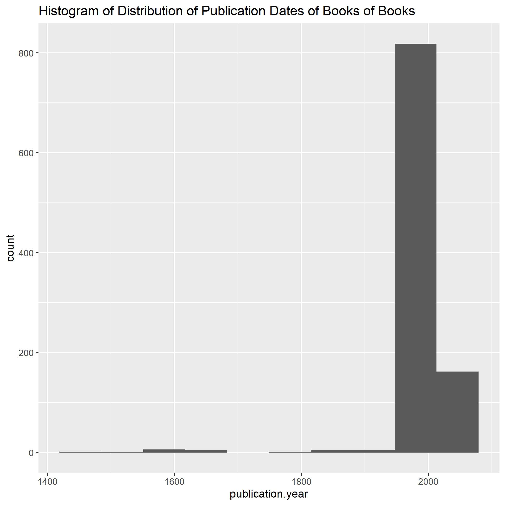
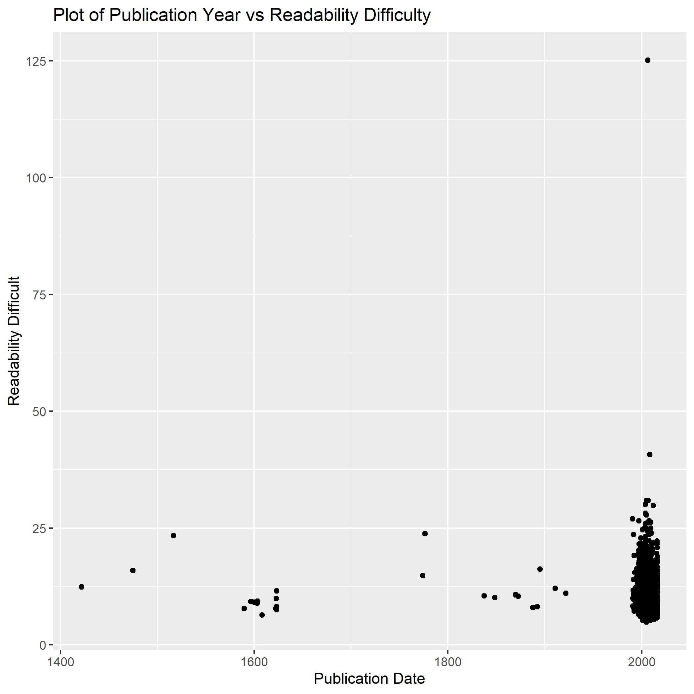
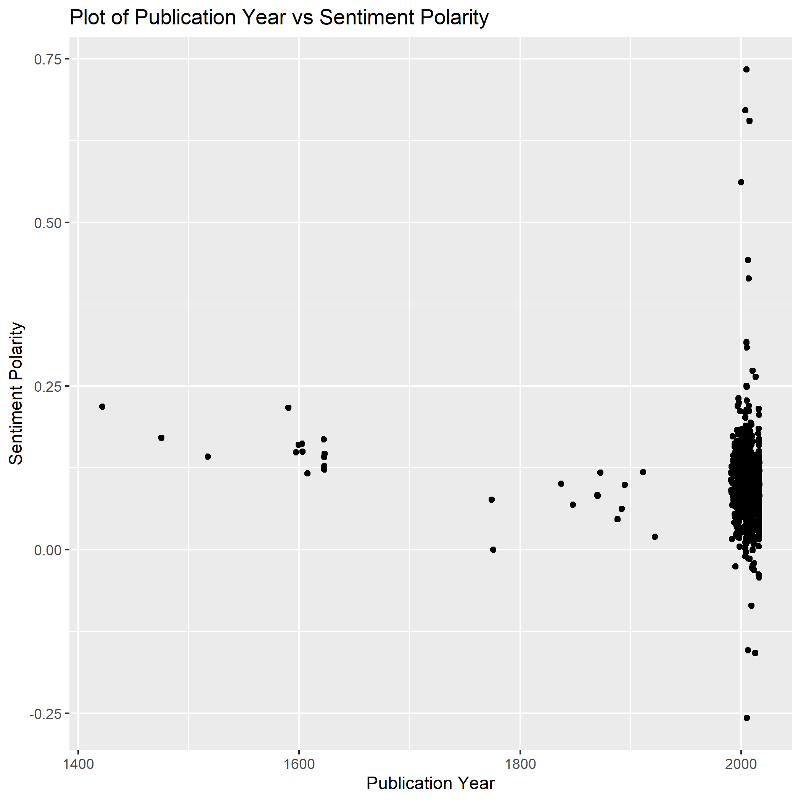

# Introduction

## Motivation 

Project Gutenberg is a free online source which provides free access to more than 60,000 books- mostly classics @project_gutenberg. Its purpose is to crete digital copies of books in the public domain and thus make them more accessible and foster a love of reading to new generations of readers. The Gutenberg project stores troves of information about each available book- including both metadata about the author and work itself as well as popularity, difficulty and readibility metrics for each book.

## Research Questions

1. Explore the changes in the prevalent sentiments and subjects in books in Project Gutenberg change based on publication year?
2. Explore the changes in the prevalent sentiments and subjects in books in Project Gutenberg change based on author gender, location,etc.?
3. Explore what characteristics are associated with an increase in a book's popularity for download on Project Gutenberg. Potential variables to include are publication year, length, formats the book is available in, subject matter, and reading difficulty.


# Exploratory Data Analysis

## Loading Data File


```r
books_data <- read.csv(here("Data", "classics_clean.csv"))
```


## How many observations do we have?


```r
x <- dim(books_data)
```
This shows that in the data there are 48 variables available for 1006  books. 
 

## What are the names of the columns (i.e. the variables we can use in our analysis)?

The variables have the following names:
congress.classifications, languages, subjects, title, type, downloads, id, rank, url, author.birth, author.death, author.name, publication.day, publication.full, publication.month, publication.month.name, publication.year, formats.total, formats.types, automated.readability.index, coleman.liau.index, dale.chall.readability.score, difficult.words, flesch.kincaid.grade, flesch.reading.ease, gunning.fog, linsear.write.formula, smog.index, polarity, subjectivity, average.letter.per.word, average.sentence.length, average.sentence.per.word, characters, polysyllables, sentences, syllables, words, language.en, language.de, language.es, language.fr, language.it, language.la, language.nl, language.pt, language.ru, language.tl

## What is the distrivution of years of publication for the books in Project Gutenberg?



## What is the relationship between year of publication and reading difficulty as measured by the automatic readability index?

The graph does not show any significant difference in the level of difficulty in books based on 
Publication Year.

## What is the relationship between average sentence length over time? Has the average gotten longer or shorter over time?


The graph does not show any significant difference in the average length of sentences in books based on 
Publication Year.

## Sentiment Analysis



Provided in the Project Gutenberg data is a sentiment polarity score that aims to quantify the positivity or negativity of a work in general. 
This plot does not show a relationship between publication year and sentiment polarity.


# Analysis
In order to answer our research questions, we used linear regression.
To answer the first question, we implemented a linear regression model on the sentimentality index of each book compared to the publication year.We also used linear regression to examine the correlation between the 
popularity of a book (i.e. number of times it has been downloaded) and the year of publication.


# Results
The linear model of the year of publication vs the sentimentality index for 
each book.

```r
model<-readRDS(here("data","tidy_model.rds"))
print(model)
```

```
## # A tibble: 2 x 5
##   term                   estimate std.error statistic    p.value
##   <chr>                     <dbl>     <dbl>     <dbl>      <dbl>
## 1 (Intercept)            0.331    0.0719         4.60 0.00000483
## 2 data$publication.year -0.000115 0.0000360     -3.20 0.00143
```
The table above  shows the parameters of the linear regression model:

The linear regression plot can be seen below:


Linear Model for the 
# Discussion and Conclusions
